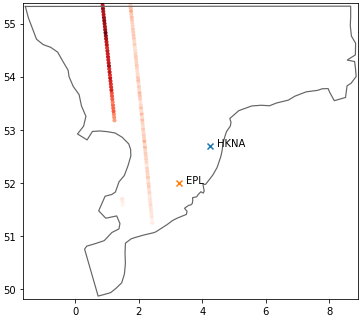
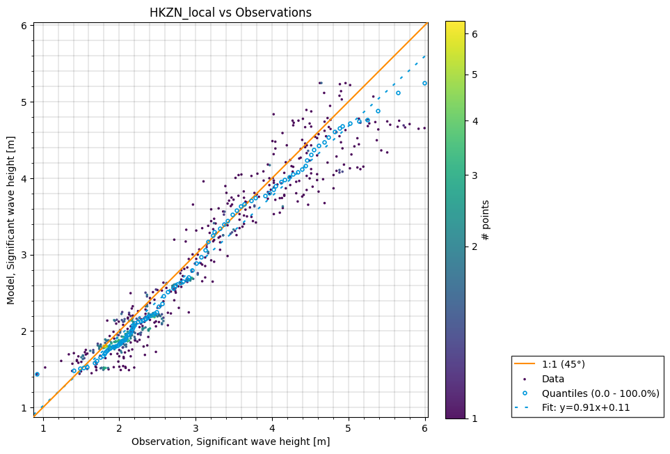
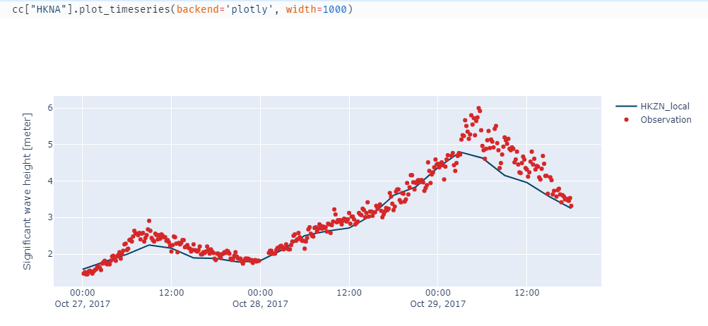

# mikefm-skill
Compare results from [MIKE FM](https://www.mikepoweredbydhi.com/products/mike-21-3) simulations with observations


## Installation

    > pip install https://github.com/DHI/mikefm-skill/archive/master.zip

## Example notebooks

See examples of use in these notebooks

* [basic.ipynb](https://nbviewer.jupyter.org/github/DHI/mikefm-skill/blob/main/notebooks/basic.ipynb)
* [skill.ipynb](https://nbviewer.jupyter.org/github/DHI/mikefm-skill/blob/main/notebooks/skill.ipynb)
* [timeseries_compare.ipynb](https://nbviewer.jupyter.org/github/DHI/mikefm-skill/blob/main/notebooks/timeseries_compare.ipynb)
* [SW_DutchCoast.ipynb](https://nbviewer.jupyter.org/github/DHI/mikefm-skill/blob/main/notebooks/SW_DutchCoast.ipynb)


## Usage
```python
>>> from mikefm_skill.model import ModelResult
>>> from mikefm_skill.observation import PointObservation
>>> mr = ModelResult("Oresund2D.dfsu")
>>> klagshamn = PointObservation("smhi_2095_klagshamn.dfs0", item=0, x=366844, y=6154291, name="Klagshamn")
>>> drogden = PointObservation("dmi_30357_Drogden_Fyr.dfs0", item=0, x=355568, y=6156863)
>>> mr.add_observation(klagshamn, item=0)
>>> mr.add_observation(drogden, item=0)
>>> collection = mr.extract()
>>> collection.skill_report()
                       bias  rmse  corr_coef  scatter_index
Klagshamn              0.18  0.19       0.84           0.32
dmi_30357_Drogden_Fyr  0.26  0.28       0.51           0.53
```

### Overview of observation locations



### Scatter plot



### Timeseries plot

Timeseries plots can either be static and report-friendly ([matplotlib](https://matplotlib.org/)) or interactive with zoom functionality ([plotly](https://plotly.com/python/)).


