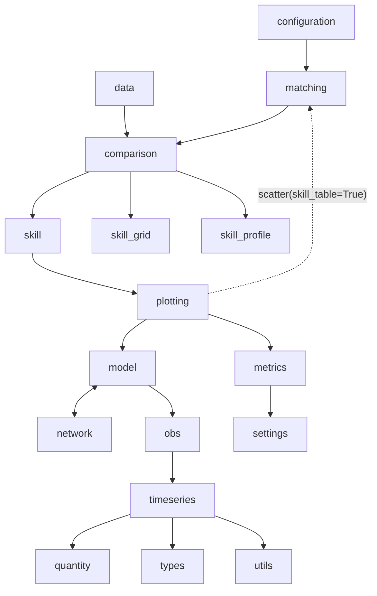

# ADR-013: Enforced Import Layering

**Status**: Accepted

**Date**: 2026-09

## Context

ModelSkill's modules have an order to them — `timeseries` knows nothing about `comparison`, and `comparison` builds on `model` and `obs` — but nothing recorded or checked it. A module could import any other, and the only way to find out whether the structure still held was to read the imports.

It had already started to give. Four modules imported a name from the root package (`from . import Quantity`) rather than from the module defining it. Since `modelskill/__init__.py` imports the whole package, each of those is an edge to everything, and an import cycle back through `__init__`: `obs` → `modelskill` → `obs`. It works only because the names happen to resolve in the order `__init__` runs. `plot.scatter(skill_table=True)` calls `from_matched` to build a `Comparer` for its table, a call from `plotting` up into `matching`, which had to be deferred into the function body or the import would fail outright.

Both are the same failure: a dependency pointing the wrong way, worked around at the call site instead of being noticed.

## Decision

Write the layering down in `.importlinter` and check it with [import-linter](https://import-linter.readthedocs.io/) on every build (`just layers`, part of `just check`).

Modules may import downward and never upward. Modules sharing a layer may import each other (`model` and `network` do).

Arrows point from importer to imported; transitively implied edges are omitted. The dotted arrow is the one accepted violation.

Three imports are ignored, each with its reason in the config. Two are reads of `__version__`, which lives in `__init__.py` and so pulls in the package. The third is the `plotting` → `matching` call above.

## Alternatives Considered

**Leave it to review** — the four root-package imports and the deferred `from_matched` all passed review. A reviewer sees one import, not what it does to the graph.

**ruff's banned-api or a custom check** — ruff is per-file and has no import graph, so it cannot express "below `comparison`" or catch a violation that only exists as a chain through a third module.

**Acyclic-siblings or independence contracts instead of layers** — these forbid cycles without saying which direction is correct. Layers state the intended shape, so a new module has somewhere to belong.

**Fix `scatter(skill_table=True)` first** — worth doing, but it is a behaviour change to a public plotting argument. Recording it as a listed exception makes it visible now; the contract would otherwise have to wait on it.

## Consequences

- A new module has to be placed in a layer, which is the question worth asking when adding one.
- Type-only imports are excluded (`exclude_type_checking_imports`), so an annotation may point upward. `timeseries._align` imports `Observation` this way.
- The ignore list is the debt list. It is three lines; if it grows, the layering is wrong or the code is.
- `from . import X` inside the package is now a violation wherever it crosses a layer, which is the right default anyway — it names the re-export rather than the source.
- import-linter is a test-group dependency, next to mypy, since that is what CI installs.
