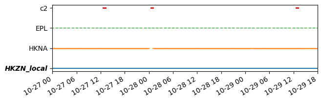
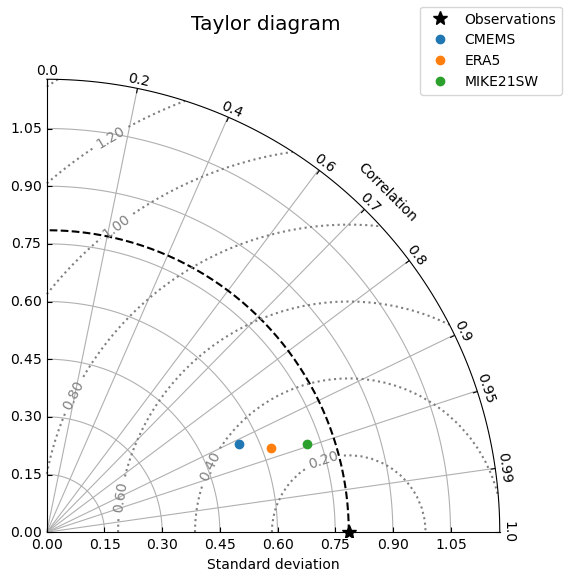
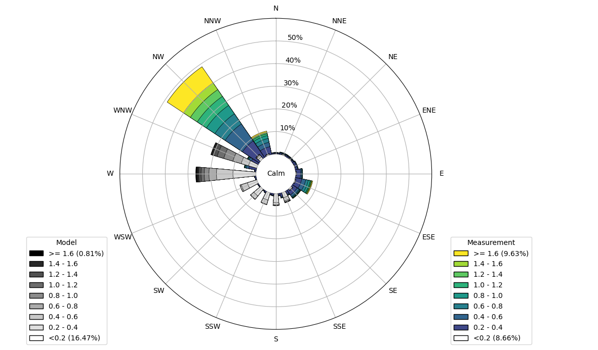

# Plotting

## Plotting observations and model results

PointObservations and PointModelResults can be plotted using their `plot` accessor:

```python
>>> o.plot.timeseries()
>>> mr.plot.timeseries()
>>> mr.plot.hist()
```

Only the observation time series is shown here:


## Plotting temporal coverage

The temporal coverage of observations and model results can be plotted using the [`temporal_coverage`](../api/plotting.md/#modelskill.plotting.temporal_coverage) function in the [`plotting`](../api/plotting.md) module:

```python
>>> o1 = ms.PointObservation('HKNA.dfs0', item=0, x=4.2420, y=52.6887)
>>> o2 = ms.PointObservation('EPL.dfs0', item=0, x=3.2760, y=51.9990)
>>> o3 = ms.TrackObservation("Alti_c2.dfs0", item=3)
>>> mr = ms.DfsuModelResult('HKZN_local.dfsu', item=0)
>>> ms.plotting.temporal_coverage(obs=[o1, o2, o3], mod=mr)
```




## Plotting spatial overview

The spatial coverage of observations and model results can be plotted using the [`spatial_overview`](../api/plotting.md/#modelskill.plotting.spatial_overview) function in the [`plotting`](../api/plotting.md) module:

```python
>>> ms.plotting.spatial_overview([o1, o2, o3], mr)
```


## Plotting compared data

The `plot` accessor on a Comparer or ComparerCollection object can be used to plot the compared data:

```python
>>> cmp.plot.timeseries()
>>> cc.plot.timeseries()
>>> cc.plot.scatter()
```


## Plotting Taylor diagrams

A Taylor diagram shows how well a model result matches an observation in terms of correlation, standard deviation and root mean square error. The `taylor` plot can be accessed through the Comparer [`plot`](../api/comparer.md/#modelskill.comparison._comparer_plotter.ComparerPlotter) accessor or the ComparerCollection [`plot`](../api/comparercollection.md/#modelskill.comparison._collection_plotter.ComparerCollectionPlotter) accessor:

```python
>>> cc = ms.match([o1, o2, o3], [mr_CMEMS, mr_ERA5, mr_MIKE21SW])
>>> cc.plot.taylor()
```



The radial distance from the point to the observation point is the standard deviation ratio, the angle is the correlation coefficient and the distance from the observation point to the model point is the root mean square error ratio. The closer the model point is to the observation point, the better the model result matches the observation. The closer the model point is to the origin, the better the model result matches the observation in terms of standard deviation and root mean square error. The closer the model point is to the horizontal axis, the better the model result matches the observation in terms of correlation. 


## Plotting directional data (e.g. wind or currents)

Directional data can be plotted using the [`wind_rose`](../api/plotting.md/#modelskill.plotting.wind_rose) function in the [`plotting`](../api/plotting.md) module. The function takes an array-like structure with speed and direction as columns (from one or two sources) and plots a wind rose:

```python
>>> df = pd.read_csv('wind.csv', index_col=0, parse_dates=True)
>>> ms.plotting.wind_rose(df)
```

