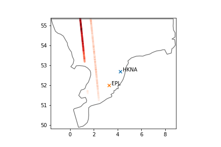
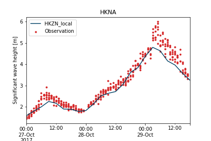
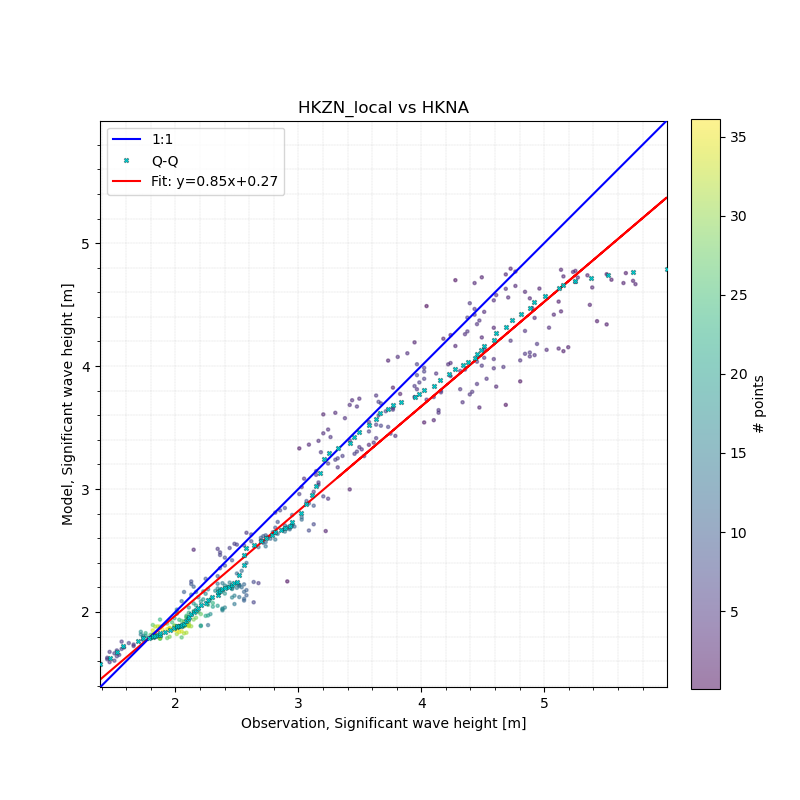
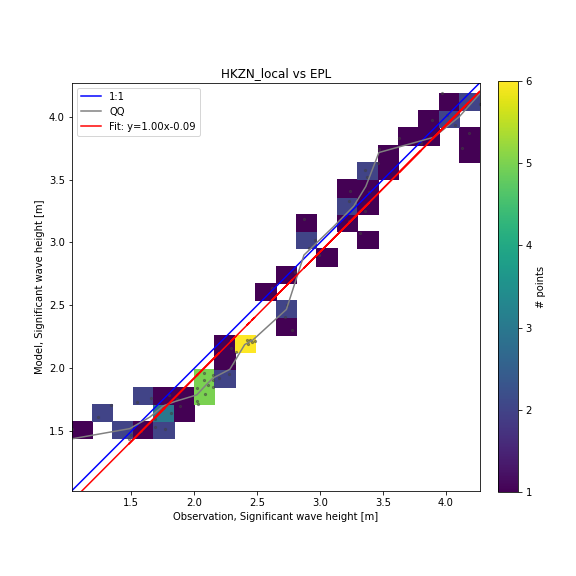
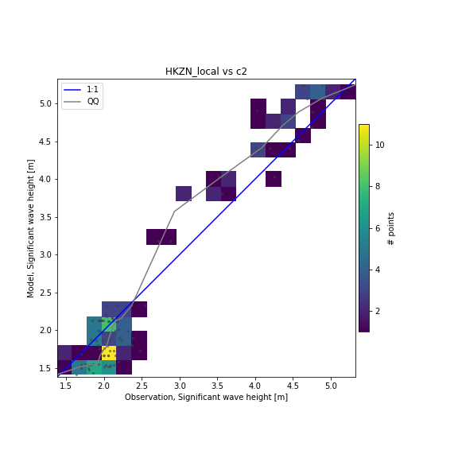

# Validation report - HKZN_local
## Observations

## Timeseries

## Aggregated skill
<table border="1" class="dataframe">
  <thead>
    <tr style="text-align: right;">
      <th></th>
      <th>n</th>
      <th>bias</th>
      <th>rmse</th>
      <th>urmse</th>
      <th>mae</th>
      <th>cc</th>
      <th>si</th>
      <th>r2</th>
    </tr>
    <tr>
      <th>observation</th>
      <th></th>
      <th></th>
      <th></th>
      <th></th>
      <th></th>
      <th></th>
      <th></th>
      <th></th>
    </tr>
  </thead>
  <tbody>
    <tr>
      <th>EPL</th>
      <td>67</td>
      <td>-0.067</td>
      <td>0.224</td>
      <td>0.213</td>
      <td>0.189</td>
      <td>0.970</td>
      <td>0.083</td>
      <td>0.933</td>
    </tr>
    <tr>
      <th>HKNA</th>
      <td>386</td>
      <td>-0.194</td>
      <td>0.352</td>
      <td>0.293</td>
      <td>0.252</td>
      <td>0.971</td>
      <td>0.094</td>
      <td>0.905</td>
    </tr>
    <tr>
      <th>c2</th>
      <td>113</td>
      <td>-0.001</td>
      <td>0.352</td>
      <td>0.352</td>
      <td>0.295</td>
      <td>0.974</td>
      <td>0.128</td>
      <td>0.900</td>
    </tr>
  </tbody>
</table>

## Scatter

